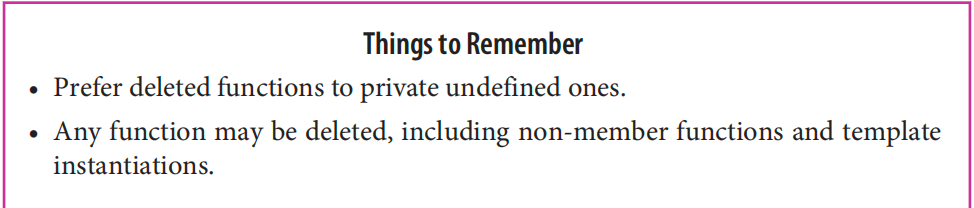

# Item 7: Distinguish between () and {} when creating objects

# Item 8: Prefer nullptr to 0 and NULL.

# Item 9: Prefer alias declarations to typedefs.

using is much easier to use than typedefs

# Item 10: Prefer scoped enums to unscoped enums

use class enum,and add :: when use

C++98-style enums are now known as unscoped enums.
• Enumerators of scoped enums are visible only within the enum. They convert to other types only with a cast.

# Item 11: Prefer deleted functions to private undefined ones.

reject functions

# Item 12: Declare overriding functions override.

