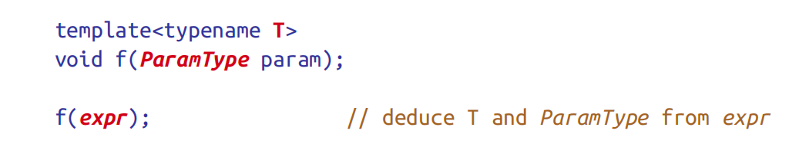
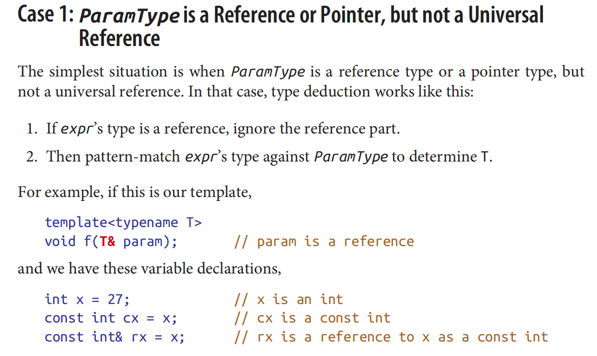
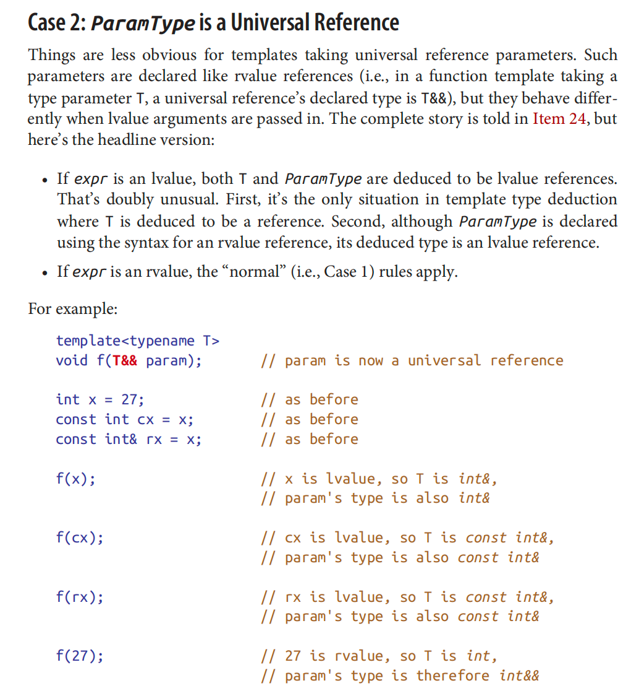
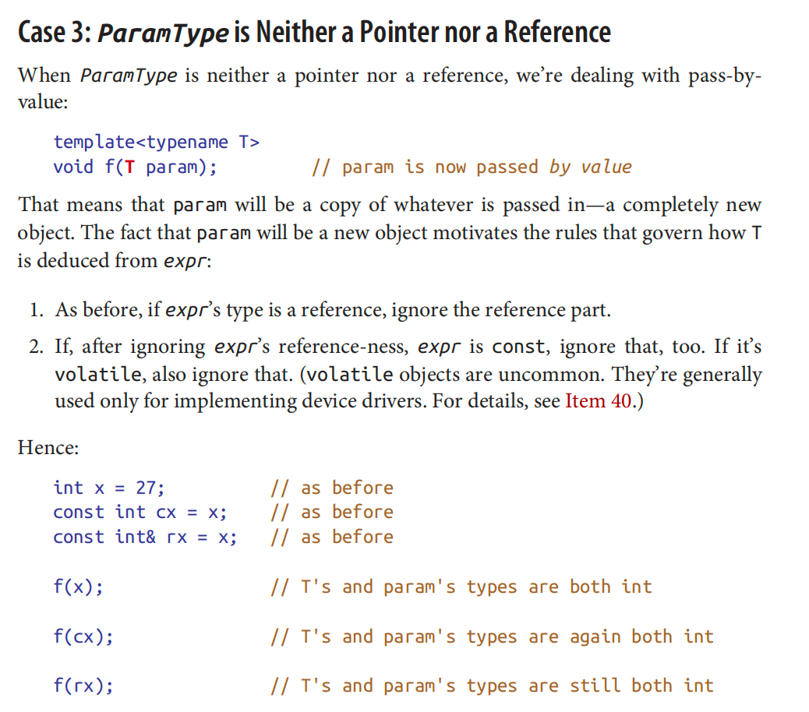
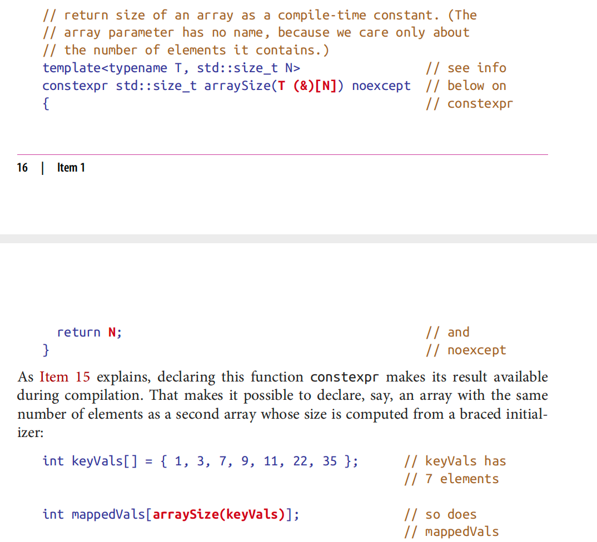

## Item 1: Understand template type deduction.

```cpp
template<typename T>
void printType(T value) {
    // ...
}

int main() {
    int num = 5;
    printType(num); // Deduces T as int
    printType("Hello"); // Deduces T as const char*
    return 0;
}
```
```cpp
template<typename T, typename U>
class Pair {
public:
    Pair(T first, U second) {
        // ...
    }
};

int main() {
    Pair<int, double> p(5, 3.14); // Explicitly specifying template arguments
    Pair q(5, 3.14); // Deduces T as int and U as double
    return 0;
}


```


```cpp
template<typename T>
void baz(T&& param) {
    // ...
}

int main() {
    int num = 5;
    baz(num); // Error: Universal reference deduction not allowed
    return 0;
}

```
## perfect forwarding
Perfect forwarding is a technique in C++ that allows passing arguments to another function while preserving their value category (lvalue or rvalue) and constness. It is typically used in conjunction with templates to forward arguments from one function template to another, without losing any information about the original argument.

The primary motivation behind perfect forwarding is to eliminate unnecessary object copies and maintain the same argument type and qualifiers when passing arguments through multiple layers of function calls. It enables generic code to efficiently handle forwarding of arbitrary arguments.

Perfect forwarding is achieved using universal references (sometimes referred to as forwarding references), which are declared using the `&&` notation. Universal references have the form `T&&`, where `T` is a template parameter.

Here's an example that demonstrates the usage of perfect forwarding:

```cpp
template<typename T>
void process(T&& arg) {
    // Some processing with arg
    anotherFunction(std::forward<T>(arg));
}

void anotherFunction(int& value) {
    // Handle lvalue reference
}

void anotherFunction(int&& value) {
    // Handle rvalue reference
}

int main() {
    int num = 42;
    process(num); // lvalue argument
    process(10);  // rvalue argument
    return 0;
}
```

In this example, the `process()` function takes a universal reference parameter `arg`, which can bind to both lvalues and rvalues. Inside `process()`, the argument `arg` is then forwarded to the `anotherFunction()` using `std::forward<T>(arg)`. This preserves the value category (lvalue or rvalue) and constness of the original argument.

The `std::forward` function is used to conditionally cast the argument to an rvalue or lvalue reference, depending on its original value category. This ensures that the argument is forwarded with the correct value category and enables overload resolution to select the appropriate `anotherFunction` overload.

By using perfect forwarding, unnecessary copies are avoided, and the original argument is passed along to the next function in its exact form, whether it was an lvalue or an rvalue. This allows for more efficient and generic code, especially when dealing with move semantics, forwarding heavy objects, or maintaining constness.

It's worth noting that perfect forwarding can be tricky to implement correctly due to reference collapsing, type deduction rules, and potential ambiguities. Therefore, it's important to understand these concepts thoroughly and use `std::forward` appropriately to ensure correct forwarding behavior.







arraysize


The code snippet you provided is a function template named `arraySize`, which takes an array reference as its argument and returns the size of the array as a `std::size_t` value. Here's a breakdown of the code:

```cpp
template<typename T, std::size_t N>
constexpr std::size_t arraySize(T (&)[N]) noexcept
{
    return N;
}
```

Let's go through it step by step:

- The function template is defined using the `template` keyword, followed by the template parameters `typename T` and `std::size_t N`. This means that the function can work with arrays of any type `T` and any size `N`.
- The function is declared as `constexpr`, which means it can be evaluated at compile-time if the input allows it. This enables the function to be used in constant expressions.
- The function parameter is defined as `T (&)[N]`, which is a reference to an array of type `T` with size `N`. The use of reference ensures that the array is not decayed into a pointer.
- The function body consists of a single line that returns the size `N` of the array. The `N` represents the number of elements in the array.

This function template allows you to determine the size of an array at compile-time by passing it as an argument to the `arraySize()` function. The template deduction mechanism infers the type `T` and size `N` of the array from the argument, and the `N` value is then returned as the result.

Here's an example usage of the `arraySize()` function:

```cpp
int main() {
    int arr[5];
    std::cout << arraySize(arr) << std::endl;  // Output: 5
    return 0;
}
```

In this example, the `arraySize()` function is called with the array `arr` as an argument. The size of the array is determined and printed to the console.


# noexcept
The `noexcept` specifier is used in C++ to indicate that a function does not throw any exceptions. It is part of the function declaration and serves as a promise or contract that the function will not raise exceptions during its execution.

The `noexcept` specifier can be used in two different ways:

1. `noexcept` without an argument:
   When `noexcept` is used without any argument, it indicates that the function will not throw any exceptions. It is added to the end of the function declaration, following the parameter list and the return type (if present).

   For example:
   ```cpp
   void myFunction() noexcept {
       // Function body
   }
   ```

   In this case, the `myFunction` is declared with `noexcept`, indicating that it will not throw exceptions. If an exception is thrown within this function, it will terminate the program.

2. `noexcept` with an argument:
   The `noexcept` specifier can also take a boolean argument, which can be a constant expression or a function call that returns a boolean value. It allows conditional exception specifications based on runtime conditions.

   For example:
   ```cpp
   bool mayThrowException() {
       // Some logic determining if an exception may be thrown
   }

   void myFunction() noexcept(mayThrowException()) {
       // Function body
   }
   ```

   In this case, the `noexcept` specifier is followed by an expression `mayThrowException()`, which determines whether the function may throw an exception or not. If the expression evaluates to `true`, the function is declared as `noexcept`; otherwise, it is not.

The `noexcept` specifier has some implications and benefits, including:

- Performance optimization: Functions declared as `noexcept` may enable certain optimizations by the compiler, as it knows that no exception handling code needs to be generated.
- Error handling and program termination: If an exception is thrown from a `noexcept` function, it generally leads to program termination, making it easier to identify unexpected exceptions.
- Interface documentation: The `noexcept` specifier provides information to users of the function, indicating that they can safely call the function without worrying about exceptions being thrown.

It's important to note that the `noexcept` specifier only guarantees that the function itself will not throw exceptions. It does not prevent exceptions from being thrown by other functions called within the `noexcept` function or by the destructors of objects with automatic storage duration.


# decay into pointers
You are correct. In addition to arrays, there are other types in C++ that can undergo decay into pointers. The concept of decay refers to the automatic conversion of certain types into pointers in certain contexts.

Here are some examples of types that can decay into pointers:

1. Function Types:
   When you use the name of a function without parentheses, it decays into a pointer to the function. This allows you to treat functions as pointers and pass them as arguments to other functions or store them in variables.

   For example:
   ```cpp
   void myFunction() {
       // Function body
   }

   int main() {
       void (*funcPtr)() = myFunction; // Function decays into a pointer
       funcPtr(); // Pointer to the function is called
       return 0;
   }
   ```

   In this case, the function `myFunction` decays into a pointer when assigned to the `funcPtr` variable.

2. Decay of Objects with Overloaded Address-Of Operator:
   Objects that have an overloaded address-of operator (`&`) can undergo decay when used with the address-of operator. In such cases, the overloaded address-of operator returns a pointer, which leads to decay.

   For example:
   ```cpp
   struct MyClass {
       int value;
   };

   MyClass obj;
   MyClass* ptr = &obj; // Address-of operator returns a pointer
   ```

   In this case, the address-of operator `&` applied to the `obj` object returns a pointer to `MyClass`, which is then assigned to the `ptr` variable.

3. Pointer-to-Member Types:
   Pointer-to-member types, which represent pointers to members of a class or structure, can also undergo decay in certain contexts. When you access a member of an object using a pointer-to-member, the pointer-to-member decays into a regular pointer.

   For example:
   ```cpp
   struct MyClass {
       int value;
   };

   int main() {
       int MyClass::* ptr = &MyClass::value; // Pointer-to-member decays into a regular pointer
       MyClass obj;
       obj.*ptr = 42; // Access member using the pointer-to-member
       return 0;
   }
   ```

   In this case, the pointer-to-member `ptr` decays into a regular pointer when assigned to the address of the `value` member.

These are just a few examples of types that can undergo decay into pointers in certain contexts. Understanding the situations where decay occurs is essential for correctly working with pointers and maintaining the desired behavior when dealing with these types.

# Item 2: Understand auto type deduction.


